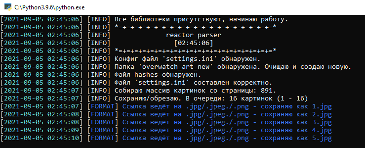
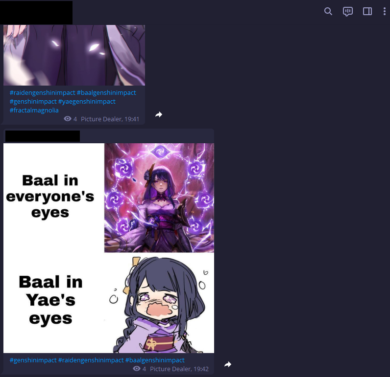

# reactor parser

[](https://github.com/NikkDusky/rprsr/releases)
[](https://github.com/NikkDusky/rprsr/)

## Requirements

```
Python 3.9
pip install loguru
pip install Pillow
pip install requests
pip install configparser
pip install BeautifulSoup4
pip install pyTelegramBotAPI
```
[](https://pypi.org/project/loguru/)
[](https://pypi.org/project/requests/) 
[](https://pypi.org/project/configparser/) 
[](https://pypi.org/project/BeautifulSoup4/)
[](https://pypi.org/project/Pillow/) 
[](https://pypi.org/project/pyTelegramBotAPI/)

## About

Little image parser, after parsing one page, send (jpg, jpeg, png, gif) to telegram chat. Also checks content with hashes.

## Screenshots





